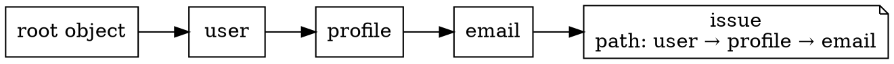

# Issues and Paths

A failed Valchecker execution returns structured issues. Two fields answer different questions: `path` identifies **where in the input data** the failure belongs, while `context` can record **how evaluation reached that failure** without pretending provenance is part of the data path.

## The issue model

| Field | Meaning |
| --- | --- |
| `code` | stable machine-readable identity of the failing contract |
| `category` | broad failure class: validation, operation, or internal |
| `message` | resolved human-readable message |
| `path` | `PropertyKey[]` locating the failing data value |
| `payload` | structured details owned by the originating issue contract |
| `context` | optional non-data provenance such as a union branch |

Individual step entries in the generated [API Reference](/api/overview) own their exact codes and payloads. This page owns how those issues compose across a schema.

## Nested structures extend the data path



When an object child fails, `object()` clones the child issue and prepends the property key. Nested objects repeat that operation, so the final path describes the failing data location from the outer schema's point of view.

The checked example below demonstrates a nested path and a separate union-provenance case:

<<< ../.examples/core-concepts/issues-and-paths/example.ts

Its runtime test verifies that the nested email failure has:

```ts
['user', 'profile', 'email']
```

## Path is data location; context is provenance

A union tries branches against the same input value. A branch number is therefore not a child property or array index and must not be inserted into `path`.

Instead, failed union branch issues retain their data path and receive context such as:

```ts
const branchContext = { type: 'union', branchIndex: 0 } as const
```

The checked fixture verifies that `union(false)` produces branch issues with an empty root path while branch identity appears in `context`.

This distinction lets consumers use `path` for form fields, object navigation, or API error locations without parsing evaluation metadata out of the address.

## Parent composition clones rather than mutates child issues

The core path and context helpers rebuild issue records when adding path segments or provenance. A parent therefore does not need to mutate an issue object created by a child schema.

That matters for reused or frozen issue data and for nested composition: each outer schema can apply its own location or context while preserving the originating issue contract.

## Use the fields for different jobs

- route UI errors by `path`;
- branch on `code` and `category` in application logic;
- inspect `payload` when the originating contract exposes machine-readable details;
- use `context` when diagnostic provenance matters;
- display `message` to humans, but do not parse it to recover structured meaning.

For compatibility guarantees around the complete issue/result shape, see the [Valchecker 1.0 Contract](/reference/v1-contract).
