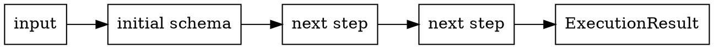

# Pipeline and Chaining

A Valchecker schema is an ordered sequence of runtime steps plus the type state that describes what those steps accept and produce. Chaining adds work to that sequence; it does not mutate the schema you already had.

## A schema is an ordered pipeline



Execution starts with a success result containing the input value. Each registered runtime step receives the previous `ExecutionResult` and returns the next one. The core can register a runtime step as success-only, failure-only, or general; each step's own Reference contract defines which behavior it uses.

That model matters because ordering is observable. A transformation placed before a validation changes the value that validation receives; a transformation placed after it does not retroactively affect the earlier check.

## Chaining creates a new schema

```ts
import { v } from 'valchecker'

const rawName = v.string()
const trimmedName = rawName.toTrimmed()
const requiredName = trimmedName.isNotEmpty()
```

The core copies the current runtime-step array before invoking the next method, then builds a new schema instance around that new array. `rawName`, `trimmedName`, and `requiredName` therefore remain independent reusable schemas.

This is replacement-based immutability, not a mutable builder hidden behind fluent syntax.

## Runtime state and type state move together

At runtime, a schema stores its ordered steps and an execution-mode summary. At the type level, each method returns a new `Next<...>` state that can update the inferred output, issue union, and execution mode.

The two layers describe the same pipeline from different angles, but they are not the same data structure. [Types and Runtime Behavior](/core-concepts/types-and-runtime) covers that boundary in detail.

## A failure is still pipeline state

A failure result is not an exception that escapes the pipeline. It is an `ExecutionResult` carrying issues, so a later runtime step can receive it when that step's contract is defined to operate on failure or on both result states.

Ordinary validation failure therefore stays inside the schema execution model. Unexpected internal exceptions are converted to structured internal issues by the core execution wrapper rather than being confused with a normal validation result.

## Keep leaf contracts in Reference

This page owns the pipeline mental model. It does not own the exact options, issue codes, or edge cases of `string()`, `toTrimmed()`, `isNotEmpty()`, or any other individual step. Those remain in the generated [API Reference](/api/overview).
