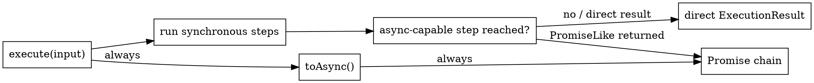

# Synchronous and Asynchronous Execution

Valchecker does not turn an entire schema into an unconditional promise merely because one callback can be asynchronous. Execution stays synchronous until reached work actually returns a promise-like value, unless the schema is explicitly converted with `toAsync()`.



## Three useful execution contracts

### Synchronous

A fully synchronous pipeline returns `ExecutionResult` directly.

### Maybe-async

A callback-driven step such as `check()` or `transform()` can return either directly or through a promise-like value. If execution fails before that callback is reached, the call may still return synchronously.

### Always async

`toAsync()` adds an async runtime step and changes the type state to `async`. Public `execute()` then normalizes every invocation to a native promise, including an input that would otherwise fail before any callback is reached.

## The reached path decides maybe-async completion

The same schema can therefore have two observable completion shapes for different inputs:

<<< ../.examples/core-concepts/sync-and-async/example.ts

The checked fixture proves all three cases:

- `reachedCallbackResult` is a `Promise` because execution reaches the async callback;
- `earlyFailureResult` is a direct failure because `string()` rejects before that callback runs;
- `alwaysAsyncEarlyFailure` is still a native `Promise` because the schema has been converted with `toAsync()`.

## Type mode and runtime mode are related, not identical

The type state tracks `sync`, `maybe-async`, or `async` so `execute()` exposes the corresponding return type. The runtime also keeps an execution-mode summary, but callback steps are conservatively registered as maybe-async because callback asynchrony is not knowable from the function object at schema-construction time.

That distinction is intentional: the type system may infer a narrower callback result in some cases while the runtime still chooses the safe executor path.

## Await when either completion shape is acceptable

JavaScript `await` accepts both plain values and promises, so this is the simplest application boundary when direct versus asynchronous completion does not matter:

```ts
import { v } from 'valchecker'

const input: unknown = 'Alice'

const schema = v.string()
	.check(async value => value.length > 0)

const result = await schema.execute(input)
```

Use `toAsync()` when the API contract itself requires `Promise<ExecutionResult<...>>` on every call, not merely because `await` is convenient.

Exact callback return forms and issue behavior stay in the generated [`check()`](/api/helpers#check) and [`transform()`](/api/helpers#transform) reference entries.
