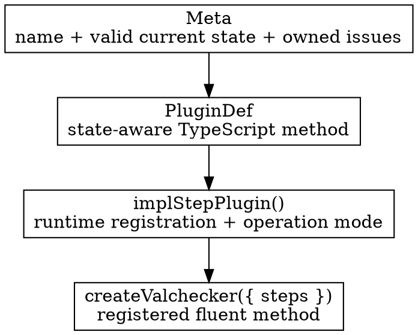

# Custom Step Plugins

Create a custom step plugin when a reusable domain operation deserves a named fluent method and should participate in Valchecker's type state, issue inference, execution mode, and selective-instance registration.

For one-off application logic, prefer [`check()`](/api/helpers#check) or [`transform()`](/api/helpers#transform). A plugin is an API surface you intend to reuse.

## The three authoring layers

The layers have different jobs:

1. `Meta` states the method identity, the schema state on which the method is valid, and the issue contract it owns.
2. `PluginDef` describes the public fluent TypeScript signature and how the current type state changes.
3. `implStepPlugin()` connects that definition to runtime construction behavior and returns a registered plugin value.

Keeping those roles separate is what lets the runtime implementation and the fluent type system describe the same extension.

## Build a first validation plugin

The canonical example defines `isPositive()`, registers it beside the built-in `number` initial step, and exports a schema that can use the new method:

<<< ../.examples/extending/custom-step-plugin/example.ts

Its runtime test proves both the successful value and the custom step's owned issue code/category/payload.

Notice two details in the example:

- the implementation is created through `implStepPlugin<PluginDef>()` instead of hand-casting an object;
- `/* @__NO_SIDE_EFFECTS__ */` sits directly above plugin construction so consumers can tree-shake an unselected plugin when the surrounding package is configured for side-effect-free modules.

## Make issue ownership explicit

A validation plugin should declare the issue it can originate in `Meta.SelfIssue`, then create that same contract at runtime. Keep the code stable and machine-readable; custom messages are presentation policy layered on top.

Use an `operation` issue rather than a validation issue when a callback or operation itself fails rather than simply deciding the input is unacceptable. Internal issues are reserved for fatal execution machinery failures.

Do not copy built-in issue catalogs into this guide. The point is the ownership pattern; each plugin owns its own public issue contract.

## Choose the operation mode conservatively

`implStepPlugin()` can declare a default operation mode for registrations made by the plugin.

Use `'sync'` only when every registration that inherits that default is guaranteed not to return a thenable. Callback-driven plugins normally need a maybe-async boundary unless their implementation enforces synchronous callbacks.

Individual step registrations can choose their own mode when the plugin contains operations with different completion guarantees. The runtime/type distinction is explained in [Synchronous and Asynchronous Execution](/core-concepts/sync-and-async).

## Prefer named domain methods over generic callbacks when reuse matters

A good custom method communicates a reusable contract:

- `isPositive()` is a stable domain predicate with a named issue contract;
- `toCodePoints()` can be a reusable transformation with a predictable output type;
- a one-off comparison against component state usually belongs in `check()` instead.

The threshold is not code length. It is whether callers benefit from a shared name, reusable type transition, issue identity, and plugin registration boundary.

## Use supported public extension imports

Build third-party plugins from root exports of `@valchecker/internal`. Do not import package-private source paths or unexported runtime helpers; those are not part of the supported extension boundary.

For the formal compatibility guarantees around public plugin exports, see the [Valchecker 1.0 Contract](/guide/v1-contract).

## Move cross-plugin behavior to composition contracts

If one plugin must advertise a capability to another, preserve metadata across a fluent boundary, or participate in selective instances and cross-package tree-shaking, do not couple the plugins with private imports. Continue with [Plugin Composition and Distribution](/extending/plugin-composition-and-distribution).
