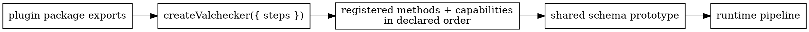

# Plugin Composition and Distribution

A plugin should be independently registerable. When plugins need to cooperate, use Valchecker's explicit composition surfaces instead of private imports or name-based runtime probing.



## Select only the plugins an instance needs

A selective instance makes the runtime and bundle boundary explicit:

```ts
import { createValchecker, isAtLeast, number } from 'valchecker'

const numeric = createValchecker({
	steps: [number, isAtLeast],
})

const schema = numeric.number()
	.isAtLeast(0)
```

The default `v` instance is convenient because it contains every built-in step. A selective instance is useful when a library or application wants a smaller, explicit plugin surface or needs to add third-party steps.

A custom plugin must be constructed through `implStepPlugin()` before it crosses the `createValchecker({ steps })` boundary. [Custom Step Plugins](/extending/custom-step-plugins) shows the complete authoring path.

## Treat registration order as observable composition state

A Valchecker instance registers its plugin set in the order supplied. That order matters when several plugins advertise the same capability and a consumer intentionally chooses the first matching provider.

Do not make overlapping capability matchers accidental. If two providers claim the same value domain, document whether earlier registration is meant to override later providers.

## Use capabilities instead of importing another plugin

Capabilities let a producer advertise behavior under a symbol while a consumer reads all registered providers for that symbol. The producer does not need to import the consumer, and the consumer does not need to hardcode the producer's method name.

This is the mechanism used by union shorthand providers: a provider can describe which branch values it recognizes, which initial method should validate them, and which parameters that method needs.

Keep capability declarations inside the `implStepPlugin()` construction call. Attaching them later as a top-level side effect is incompatible with side-effect-free bundling because an optimizer is allowed to remove an otherwise unused statement.

## Version symbol identity when it crosses package copies

A module-local `Symbol()` is correct only when producer and consumer are guaranteed to share that exact JavaScript symbol instance.

When a protocol must interoperate across separate physical package copies, use an explicitly namespaced and versioned global symbol identity, for example:

```ts
const capability = Symbol.for('example.validation.date-branch.v1')
```

Change the versioned key when the payload meaning becomes incompatible. Reusing one global symbol for a different protocol shape creates an implicit cross-package break that TypeScript cannot reliably prevent at runtime.

## Use metadata for a local fluent handoff

Construction metadata is for information owned by one step that a later step deliberately reads during schema construction. It is not persistent global schema state: a fresh construction utility object is created for each fluent call, so metadata must be explicitly propagated when the protocol requires another step to see it.

Prefer a capability when the relationship is “what can registered plugins do?” Prefer metadata when the relationship is “what did the immediately relevant constructed step record?”

## Preserve issue drafts while structures add location

A custom step originates an issue, but enclosing structural steps may still add `path`, context, or message scopes before the public result is finalized. Use the issue-propagation utilities supplied by the plugin construction context rather than spreading an internal draft into a new plain object.

The reader-facing consequence is the same contract described in [Issues and Paths](/core-concepts/issues-and-paths): data location is composed outward while the originating issue identity remains owned by the step.

## Keep exported plugin construction tree-shakeable

For a side-effect-free plugin module:

- export the plugin value produced by `implStepPlugin()`;
- keep `/* @__NO_SIDE_EFFECTS__ */` directly above plugin construction when using the same build convention as Valchecker;
- declare capabilities as part of that construction call rather than a later mutation;
- avoid unrelated top-level side effects that force bundlers to retain the module.

Valchecker's own `allSteps` collection discovers exported built-in plugin values through the runtime plugin marker; it does not maintain a second handwritten list. Third-party packages do not need to imitate `allSteps` unless they intentionally provide an “everything in this package” collection.

## Separate consumer extension docs from built-in contribution workflow

The supported public extension boundary is about authoring and distributing plugins against root exports from `@valchecker/internal` and registering them through `createValchecker()`.

Contributing a built-in step to this repository adds internal responsibilities such as colocated `.doc.md`, benchmarks, API-surface checks, repository exports, and quality gates. Those are contributor workflow and stay owned by `AGENTS.md` and the `valchecker-dev` skill rather than being duplicated into public extension documentation.
