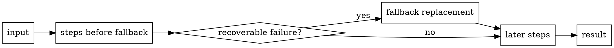

# Fallback and Recovery

Use `fallback()` when a documented default or recovery value should turn an earlier recoverable failure into a successful pipeline value. Treat it as an explicit boundary, not as a blanket “make validation pass” switch.



## Recover at the boundary you actually own

The canonical example recovers invalid JSON, then delegates the replacement or parsed value into a structural schema:

<<< ../.examples/guides-recipes/fallback-json/example.ts

Its test proves both sides of the boundary:

- invalid JSON is replaced before structural validation;
- a valid JSON value whose later `items` structure is wrong still fails, because the earlier fallback does not guard steps appended after it.

For the exact failure categories, callback return type, and `fallback:failed` contract, use [`fallback()` in Reference](/api/helpers#fallback).

## Put the fallback immediately after the failures it owns

A configuration pipeline is easier to reason about when each default sits beside the validation it recovers:

```ts
import { v } from 'valchecker'

const configSchema = v.object({
	port: v.looseNumber()
		.isFinite()
		.isInteger()
		.isAtLeast(1)
		.isAtMost(65535)
		.fallback(() => 3000),
	host: v.string()
		.toTrimmed()
		.isNotEmpty()
		.fallback(() => 'localhost'),
})
```

That placement documents which upstream defects are intentionally recoverable. A later rule can still fail normally.

## Use more than one boundary when the stages are different

A pipeline may recover parsing first, then validate the replacement, then apply a later recovery for a different contract:

```ts
const schema = v.string()
	.toJSONValue()
	.fallback(() => ({}))
	.check((value): value is { items: unknown } =>
		typeof value === 'object'
		&& value !== null
		&& 'items' in value,
	)
	.fallback(() => ({ items: [] }))
```

Each fallback sees only the recoverable failure state that reaches its position. This makes recovery order visible in the chain rather than hiding it in an outer `try`/`catch`.

## Do not recover fatal internal issues

Internal issues represent failures in the validation machinery or user callbacks that Valchecker classifies as fatal. `fallback()` does not invoke its recovery callback for an internal issue.

That boundary matters for observability: a documented default may recover bad configuration input, but it should not silently conceal a broken message resolver or an unexpected internal execution failure.

## Async recovery stays path-dependent

A fallback callback may perform asynchronous work. If the callback is not reached, an otherwise synchronous path can still finish directly. If your public API requires a native promise every time, append [`toAsync()`](/api/helpers#toasync).

Read [Synchronous and Asynchronous Execution](/core-concepts/sync-and-async) for the execution-mode model rather than duplicating it here.

## Use recovery for product policy, not data denial

Good recovery candidates include documented configuration defaults, cache fallbacks, optional imports, or intentionally lossy normalization. Be more cautious when a fallback could hide corrupted source data or an integrity violation.

A practical rule: if the application owner would want to know that recovery happened, log or measure that event at the application boundary even when the schema intentionally succeeds.
